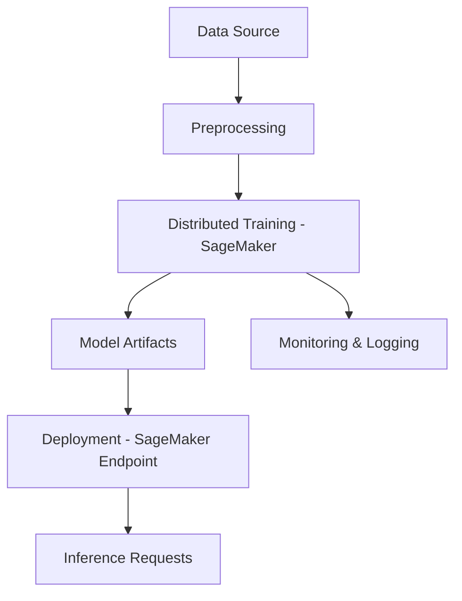

# End-to-End Distributed LLM Engineering with SageMaker

This repository demonstrates how to build, train, and deploy Large Language Models (LLMs) using Amazon SageMaker. It covers the complete process—from data preparation, distributed training, to scalable deployment—leveraging modern MLOps practices for efficiency and reproducibility.

---

## Table of Contents

- [Overview](#overview)
- [Features](#features)
- [Architecture](#architecture)
- [Setup and Installation](#setup-and-installation)
- [Usage](#usage)
- [Data Preparation](#data-preparation)
- [Distributed Training](#distributed-training)
- [Model Deployment](#model-deployment)
- [API Endpoints](#api-endpoints)
- [Monitoring and Logging](#monitoring-and-logging)
- [Testing](#testing)
- [Best Practices](#best-practices)
- [Troubleshooting](#troubleshooting)
- [Contributing](#contributing)
- [License](#license)
- [Acknowledgements](#acknowledgements)

---

## Overview

This project provides an end-to-end workflow for distributed LLM engineering using Amazon SageMaker. It supports data ingestion, preprocessing, distributed model training, evaluation, and deployment as a scalable endpoint. The solution is designed for practitioners looking to scale LLM pipelines efficiently.

---

## Features

- Distributed multi-node LLM training on SageMaker
- Automated data preprocessing and feature engineering
- Model checkpointing and evaluation
- Scalable model deployment for inference
- End-to-end MLOps pipeline integration
- Monitoring and logging capabilities

---

## Architecture

The solution is architected to take advantage of both SageMaker's managed features and distributed training capabilities. The core components include:

- Data ingestion and preprocessing scripts
- SageMaker training jobs utilizing distributed strategies
- Model artifact management (checkpoints, logs)
- Endpoint deployment automation
- Monitoring and alerting integrations



---

## Setup and Installation

Follow these steps to set up and run the project:

1. Clone the repository:
   ```bash
   git clone https://github.com/SameaSaeed/End-to-End_Distributed_LLMEngineering_SageMaker.git
   cd End-to-End_Distributed_LLMEngineering_SageMaker
   ```
2. Set up a Python virtual environment and install dependencies:
   ```bash
   python3 -m venv venv
   source venv/bin/activate
   pip install -r requirements.txt
   ```
3. Configure your AWS credentials with the required SageMaker permissions.

---

## Usage

Below are the main steps for using this repository:

1. Prepare your dataset as described in the [Data Preparation](#data-preparation) section.
2. Edit configuration files in the `config/` directory to match your environment.
3. Launch a distributed training job using provided scripts.
4. Deploy the trained model for inference.
5. Use the provided API endpoints to interact with the deployed model.

---

## Data Preparation

Data preparation scripts ingest raw data, perform cleaning, and generate features for training. Place your raw dataset in the appropriate directory and run the preprocessing script:

```bash
python scripts/preprocess_data.py --input data/raw --output data/processed
```

- Supports multiple data formats (CSV, JSON, Parquet)
- Handles missing values and basic feature engineering

---

## Distributed Training

Training leverages SageMaker’s built-in distributed frameworks:

- Configure the number of instances, instance type, and distribution strategy in the training script or the configuration file.
- Launch training:
  ```bash
  python scripts/train_distributed.py --config config/train_config.yaml
  ```

- Supports checkpointing for resuming long-running jobs
- Logs metrics to SageMaker for monitoring

---

## Model Deployment

After a successful training run, deploy the model as a scalable endpoint:

```bash
python scripts/deploy_model.py --model artifacts/model.tar.gz --endpoint-name my-llm-endpoint
```

- Supports rolling updates for zero-downtime deployment
- Includes configuration for auto-scaling policies

---

## API Endpoints

The deployed SageMaker endpoint exposes a simple REST API for inference.

### Predict Endpoint (POST)

```api
{
    "title": "Predict",
    "description": "Submit input text to the deployed LLM for inference.",
    "method": "POST",
    "baseUrl": "https://<sagemaker-endpoint-url>",
    "endpoint": "/predict",
    "headers": [
        {
            "key": "Content-Type",
            "value": "application/json",
            "required": true
        }
    ],
    "queryParams": [],
    "pathParams": [],
    "bodyType": "json",
    "requestBody": "{\n  \"inputs\": \"Your input text here.\"\n}",
    "responses": {
        "200": {
            "description": "Inference result",
            "body": "{\n  \"outputs\": \"Model prediction/result\"\n}"
        },
        "400": {
            "description": "Bad Request",
            "body": "{\n  \"error\": \"Invalid input.\"\n}"
        }
    }
}
```

---

## Monitoring and Logging

The pipeline logs key metrics and events:

- Training logs viewable in SageMaker Console
- Model endpoint logs sent to Amazon CloudWatch
- Alerts can be configured for failed jobs or endpoint errors

---

## Testing

Testing ensures that each pipeline component works as expected:

- Unit tests for data preprocessing and model code
- Integration tests for distributed training scripts
- Endpoint health checks after deployment

Run tests using:

```bash
pytest tests/
```

---

## Best Practices

- Store all secrets and credentials securely (never hardcode them).
- Use version control for configuration files.
- Monitor resource usage and adjust instance types for cost efficiency.
- Automate as much as possible using CI/CD pipelines.

---

## Troubleshooting

- If training fails, check the SageMaker logs for errors.
- Ensure your AWS IAM role has the correct permissions for using SageMaker.
- For data preprocessing issues, verify the input file formats and paths.
- If the endpoint is unresponsive, check CloudWatch logs for error messages.

---

## Contributing

Contributions are welcome! Please fork the repository and open a pull request with your changes. Before submitting, ensure all tests pass and follow the code style guidelines.

---

## License

This project is licensed under the MIT License. See the [LICENSE](LICENSE) file for details.

---

## Acknowledgements

- Inspired by AWS SageMaker best practices.
- Thanks to contributors and the open-source community for their support.

---

```card
{
    "title": "Get Started Fast",
    "content": "Follow the setup instructions to quickly launch your first distributed LLM job on SageMaker."
}
```